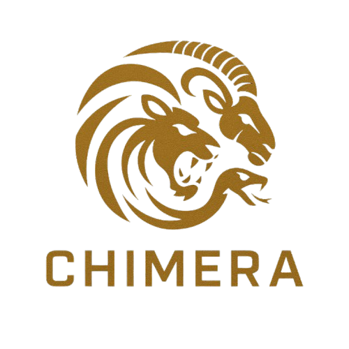

<p align="center">
  
</p>

# ChimeraAI

This project is an implementation of a diffusion transformer (DiT)-based framework for human image animation with hybrid guidance, inspired by the DreamActor-M1 research paper ([arXiv:2504.01724](https://arxiv.org/abs/2504.01724)). It provides a powerful system for generating realistic human animations from a single image using the principles and techniques described in DreamActor-M1.

## Overview

ChimeraAI is a comprehensive system for human image animation that can generate expressive, identity-preserving animations with precise control over facial expressions and body movements, maintaining consistency across frames. The system works through a multi-stage process combining a diffusion model with a transformer architecture and multiple guidance mechanisms.

### Key Features

- **Diffusion Transformer (DiT)-based Architecture**: The foundation for human image animation.
- **Hybrid Guidance Mechanism**:
  - **Motion Guidance**: Combination of control signals including implicit facial representations, 3D head spheres, and 3D body skeletons.
  - **Appearance Guidance**: Using motion patterns from sequential frames and visual references for long-term temporal coherence.
- **Scale Adaptation**: Progressive training strategy to handle various body poses and image scales.
- **Expressiveness and Robustness**: Generating expressive, identity-preserving animations with precise control and consistency.

### How It Works

```
┌─────────────────┐    ┌──────────────────┐    ┌────────────────┐
│  Input Image    │    │ Motion Source    │    │  Guidance      │
│  (Reference)    │───▶│ (Video/Skeleton) │───▶│  Extraction    │
└─────────────────┘    └──────────────────┘    └────────┬───────┘
                                                        │
┌─────────────────┐    ┌──────────────────┐    ┌────────▼───────┐
│   Generated     │◀───│   Diffusion      │◀───│   Hybrid       │
│   Animation     │    │   Transformer    │    │   Guidance     │
└─────────────────┘    └──────────────────┘    └────────────────┘
```

The system operates in the following way:

1. **Input Processing**: Takes a reference image and a motion source (video/3D data)
2. **Guidance Extraction**: Extracts facial, head, and body guidance from the inputs
3. **Hybrid Guidance System**: Combines multiple guidance signals to create detailed control
4. **Diffusion Process**: Uses a transformer-based diffusion model to generate each frame
5. **Progressive Refinement**: Multi-stage training ensures quality at different scales

## Project Structure

```
ChimeraAI/
├── data/               # Data handling (input images, motion data, scale variations)
├── models/             # Models (diffusion transformer, hybrid guidance components)
├── training/           # Training pipeline (progressive training, loss functions)
├── inference/          # Animation generation
├── evaluation/         # Animation quality assessment
├── utils/              # Helper functions (logging, visualization, configuration)
├── configs/            # Configuration files
├── tests/              # Unit tests
├── requirements.txt    # Dependencies
├── main.py             # Main entry point for all functionality
└── README.md           # This file
```

## Setup and Installation

### Prerequisites

- Python 3.8+
- CUDA-compatible GPU (recommended for training)

### Installation

1. Clone the repository:
```bash
git clone https://github.com/krjadhav/ChimeraAI.git
cd ChimeraAI
```

2. Create and activate a virtual environment (optional but recommended):
```bash
python -m venv venv
source venv/bin/activate  # On Windows, use: venv\Scripts\activate
```

3. Install dependencies:
```bash
pip install -r requirements.txt
```

## Usage

### Data Preparation

```bash
python main.py preprocess --config configs/data_preprocessing.yaml
```

### Training

```bash
python main.py train --config configs/training.yaml
```

### Inference

```bash
python main.py inference --config configs/inference.yaml --reference path/to/image.jpg --source path/to/motion_data --output path/to/output
```

### Evaluation

```bash
python main.py evaluate --config configs/evaluation.yaml --reference path/to/reference --generated path/to/generated
```

## Configuration

Configuration files are stored in YAML format in the `configs/` directory. Each module has its own configuration file that can be customized to adjust the behavior of the system.

## Advanced Usage

For more detailed instructions and advanced usage scenarios, please refer to the documentation in each module's directory.

## Limitations

While ChimeraAI provides an effective framework for human image animation, users should be aware of the following limitations:

- **Computation Requirements**: The DiT-based architecture requires significant GPU resources for training and inference, especially for full-body animations at high resolutions.
- **Motion Complexity**: Extremely complex motions with rapid pose changes may lead to temporal inconsistencies in certain scenarios.
- **Clothing Details**: Fine details in clothing or accessories might not be perfectly preserved across all frames during complex movements.
- **Background Adaptation**: The system primarily focuses on the human subject; background elements may show artifacts when the movement causes significant changes in revealed areas.
- **Multi-person Scenes**: The current implementation is optimized for single-person animations and may not handle multi-person scenes optimally.

## To Do

Future development plans for ChimeraAI include:

- [ ] **Performance Optimization**: Reduce memory requirements and improve inference speed for real-time applications
- [ ] **Enhanced Guidance Controls**: Implement more fine-grained control over specific body parts and facial expressions
- [ ] **Mobile Deployment**: Create optimized versions for deployment on mobile and edge devices
- [ ] **Multi-person Support**: Extend the framework to better handle scenes with multiple individuals
- [ ] **Interactive Editor**: Develop a user-friendly GUI for animation creation and editing
- [ ] **Style Transfer Integration**: Add the ability to apply different visual styles to the generated animations
- [ ] **Video-to-Video Adaptation**: Expand capabilities to handle video inputs for more complex animation transfers

## Citation

ChimeraAI is inspired by the DreamActor-M1 research. If you use this implementation in your research, please cite both ChimeraAI and the original DreamActor-M1 paper:

```bibtex
@article{ChimeraAI,
  title={ChimeraAI: A Framework for Human Image Animation with Hybrid Guidance},
  author={ChimeraAI Team},
  year={2025}
}

@article{DreamActorM1,
  title={DreamActor-M1: Holistic, Expressive and Robust Human Image Animation with Hybrid Guidance},
  author={Luo, Yuxuan and Rong, Zhengkun and Wang, Lizhen and Zhang, Longhao and Hu, Tianshu and Zhu, Yongming},
  year={2025},
  eprint={2504.01724},
  archivePrefix={arXiv},
  url={https://arxiv.org/abs/2504.01724}
}
```

Additionally, visit the [DreamActor-M1 project page](https://grisoon.github.io/DreamActor-M1/) for more information about the original research.

## License

[MIT License](LICENSE)
